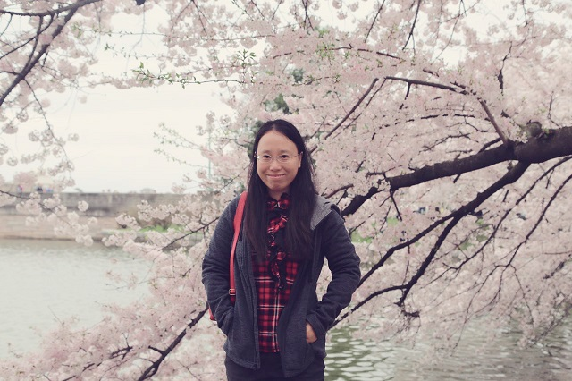

孙美君（教授、博导） 简历

天津大学，计算机科学与技术学院，教授，博士生导师

孙美君博士自05年参加工作至今为天津大学计算机学院教师。主要研究方向为智能媒体技术，计算机视觉和计算机图形学，2008年作为联合培养博士研究生在法国国家信息与自动化研究所（INRIA）访问学习，2015年美国南卡罗莱纳大学访问学者。已在国内外高水平刊物和会议上发表论文40余篇。作为项目负责人完成国家自然科学基金3项，天津市支撑计划重点项目1项。申请国家软件发明专利6项，设计与开发的中国水墨画的计算机仿真技术获得2008年天津市技术发明二等奖。

-   **联系方式：QQ：23432949，邮箱sunmeijun@tju.edu.cn，天津大学北洋园校区55楼A214**

-   **招收对人工智能、计算机视觉、图像视频分析、软件工程方向感兴趣的博士、硕士和有意向在实验室深造的本科同学。**

-   **培养学生的思路：我们实验室的宗旨是培养具有开阔眼界、创新思维、优秀编程能力、优秀论文写作、优秀表达能力和优秀道德品质的人。**

-   **实验室日常：真实项目+高水平论文+实验室日常管理+团队活动**

-   **实验室文化：实事求是，团结协作，做事情有态度有强度！**

-   **实验室条件：保证工位、台式机和GPU服务器、支持成果突出的同学申请国奖、支持发表高水平论文的同学出国参会、每月助学金、助教等一些额外工作的奖金。**

**主持或参加科研项目及人才计划项目情况：**

1、国家自然科学基金面上项目，面向癌症检测的小样本高光谱图像分类理论研究， 2019/01-2022/12，在研，主持。

2、国家自然科学基金面上项目，61572351，基于高光谱图像分析的古代壁画病害监测及艺术风格化恢复方法研究，2016/01-2019/12，结题，主持。

3、天津市支撑计划重点项目，肿瘤患者的影像大数据诊疗和分析平台，合作单位天津市医科大学肿瘤医院，2015/04-2017/09，230万，结题，主持。

4、故宫博物院横向课题，故宫博物院兰亭序书法互动系统的研究，2013/09-2015/09, 完成，主持。

略...

**近期主要论文**
1.	Ziqi Zhou, Zheng Wang, Huchuan Lu, Song Wang, **Meijun Sun**, Multi-type Self-attention Guided Degraded Saliency Detection, AAAI 2020（CCF A会长文）
2. Zheng Wang, Xinyu Yan, Yahong Han*, **Meijun Sun**, Ranking Video Salient Object Detection, ACM Multimedia, 2019,（CCF A会长文）
3. **Meijun Sun**, Z. Zhou, Q. Hu, Z. Wang*, and J. Jiang, “Sg-fcn: A motion and memory-based deep learning model for video saliency detection,” IEEE Transactions on Cybernetics, vol. PP, no. 99, pp. 1–12, 2018. （SCI 1区，IF=10.387，双检）
4. **Meijun Sun**, Dong Zhang, Zheng Wang, Jinchang Ren, Jess S.Jin, Monte Carlo Convex Hull Model for Classification of Traditional Chinese Paintings, Neurocomputing, 2016,171(c):788-797  (2区SCI, IF=3.317)
5. **Meijun Sun**, Dong Zhang, Zheng Wang, Jinchang Ren, Bolong Chai, Jizhou Sun, What's Wrong with Murals at Mogao Grottoes: a Near-Infrared Hyperspectral Image Method, Scientific Reports, 2015, 5(1):14371 (2区SCI, IF=5.578,)
